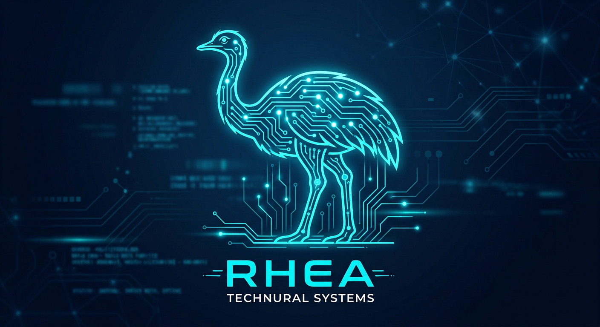
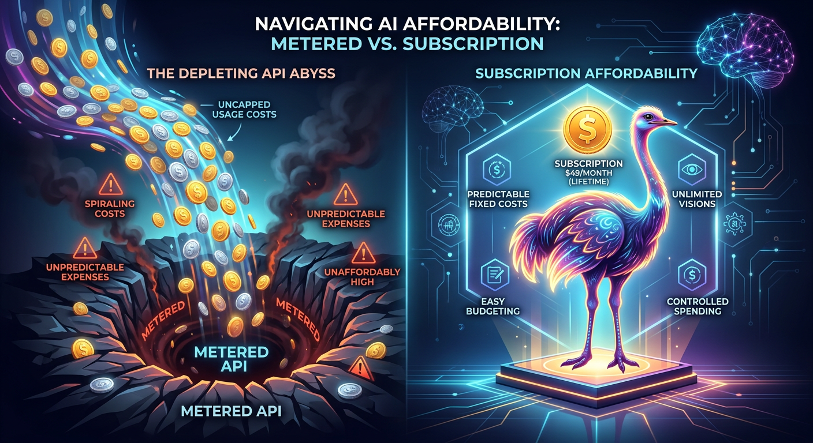
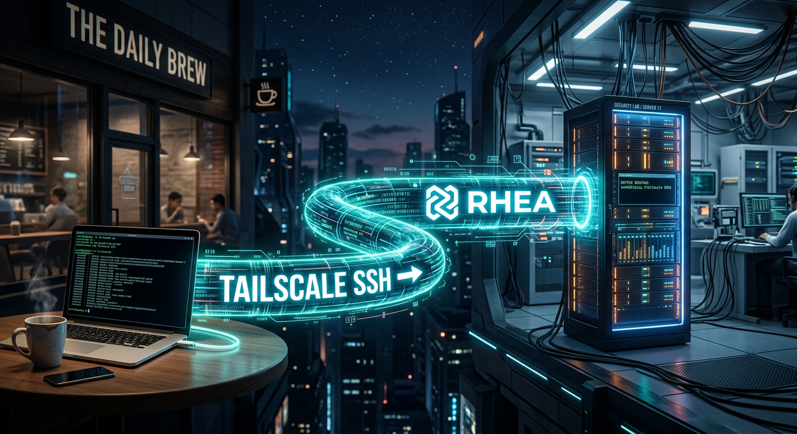
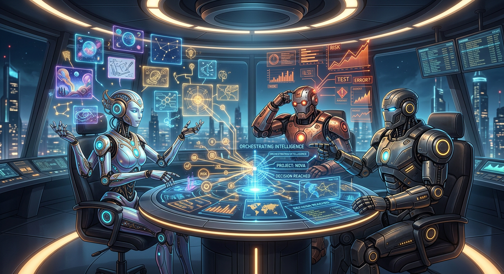

<p align="center">
  
</p>

# Rhea: Your AI Subscriptions, Now Your Private APIs

Hi, I'm **Daniel**, an AGI researcher at [Eidos AGI](https://eidosagi.com). For years, we've studied how intelligence emerges not from scaling a single model, but from the mathematical collision of multiple "minds." 

Rhea is the culmination of that research—a high-performance orchestration suite that turns your existing, subscription-backed AI CLIs (Claude Pro, Gemini Advanced, Codex) into secure, remote, and always-on APIs.

<p align="center">
  
</p>

## 💎 The "Zero-Cost" Intelligence Engine

The most powerful models in the world are already on your machine, hidden behind "consumer" subscriptions. You're already paying for them. **Rhea lets you use them to their maximum potential.**

- **Stop Paying Per-Token**: Rhea securely "tunnels" into your authenticated local environments, allowing you to use your flat-rate subscriptions as a robust API layer for your own software, agents, and IDEs.
- **Escape the "Precision Trap"**: Based on our research into [Language as Momentum](https://eidosagi.com/language-as-momentum), Rhea orchestrates multiple models to achieve "structural serendipity"—finding high-fidelity solutions that no single model could reach in isolation.

---

## 🛠️ Architecture

Rhea operates as a split client/server system, optimized for secure private networks.

<p align="center">
  
</p>

- **Rhea Server**: Runs on your authenticated machine (e.g., your personal Mac). It manages the model CLIs and exposes a narrow JSON-RPC interface.
- **Rhea Client**: Runs anywhere (VPS, Laptop, Mobile). It securely tunnels requests to the server over Tailscale SSH.

---

## 🌟 Key Features

### Intelligence Pods (Socratic Debate)
Rhea implements our "Pod" architecture: a three-model Socratic debate engine (Dreamer/Doubter/Decider). This is more than just a loop; it is a mathematical necessity for escaping the logical "local minima" of single models. 

<p align="center">
  
</p>

- **Dreamer**: Performs a "lossy projection" of the problem, expanding the solution space.
- **Doubter**: Adversarially critiques assumptions to find the "deepest flaw."
- **Decider**: Weighs the collision and commits to a final, high-confidence decision.

### Multi-modal Support (Nano Banana)
Generate and iteratively edit high-resolution images using the Gemini 3.1 Flash Image model series or cloud APIs, all managed through your secure Rhea tunnel.

---

## 🚀 Getting Started

### 1. Installation

```bash
npm install
npm run build
cd cli && npm link
```

### 2. Quick Setup
Use our interactive wizard to link your providers and pair your first server:
```bash
rhea-cli setup
```

---

## 🛡️ Security & Privacy
All traffic is encrypted via **Tailscale/WireGuard**. Rhea is designed for **Least Privilege**, running via narrow RPC commands rather than a broad shell.

---

## 📜 License
Rhea is licensed under **Creative Commons Attribution-NonCommercial-ShareAlike 4.0 International (CC BY-NC-SA 4.0)**.
*Attribution to Eidos AGI and Daniel is required. Commercial resale is strictly prohibited.*

---

## 🔬 Read the Research
If you want to understand the math behind why Rhea works, read our full study:
[**Language as Momentum: Escaping the Precision Trap**](https://eidosagi.com/language-as-momentum)
